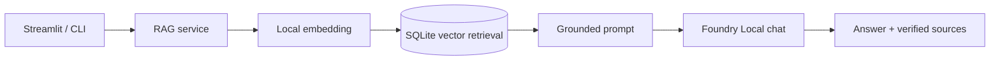

# 🎾 Yerel RAG Asistanı — Microsoft Foundry Local

Microsoft Foundry Local ile tamamen yerel çalışan bir tenis bilgi asistanı. Hafta 3 sonunda güvenli ingestion, normalize SQLite depolama, semantic/hybrid retrieval, grounded prompt, yerel cevap üretimi ve doğrulanmış kaynak gösterimi uygulanmıştır. Streamlit arayüzü Hafta 4 kapsamındadır.

> Aşağıdaki ekran görüntüleri tamamlanması hedeflenen kullanıcı arayüzünü göstermektedir; Streamlit arayüzü henüz bu depoda uygulanmamıştır.


---

##  RAG Nedir?

RAG (Retrieval-Augmented Generation), büyük dil modellerini harici bilgi kaynaklarıyla zenginleştiren bir mimaridir. Genel bir LLM'e özel bir soru sorulduğunda model ya yanlış cevap verir ya da bilgi uydurmaya çalışır (hallucination). RAG bu problemi üç adımla çözer:

1. **Retrieve** — Kullanıcı sorusuna en alakalı doküman parçalarını bul
2. **Augment** — Bu parçaları modele bağlam olarak ekle
3. **Generate** — Model bağlamı kullanarak doğru cevabı üretsin

Bu projede Retrieve, Augment ve Generate adımlarının tamamı yerel ana uygulama akışındadır.

---

##  Proje Mimarisi

Kullanıcı Sorusu
↓
Sorgu Embedding'i (qwen3-embedding-0.6b)
↓
Hibrit Arama: %70 Semantic (cosine similarity) + %30 Keyword
↓
SQLite'tan En Yakın 3-5 Chunk
↓
Grounded Prompt → Microsoft Foundry Local LLM
↓
Doğrulanmış Kaynak Listeli Cevap

### Hibrit Arama Neden?
Sadece semantic (embedding) araması kısa sorgularda yetersiz kalabiliyor. Örneğin "teniste vuruşlar" gibi kısa bir sorguda embedding tek başına doğru chunk'ları getiremiyor. Bu yüzden basit keyword eşleşmesini de %30 ağırlıkla birleştirdik.

---

##  Kullanılan Teknolojiler

| Teknoloji | Kullanım Amacı |
|-----------|---------------|
| Microsoft Foundry Local SDK (WinML) | Çevrimdışı LLM ve embedding modeli çalıştırma |
| qwen3-embedding-0.6b | Metin embedding modeli (1024 boyutlu vektör) |
| qwen3-1.7b | Grounded soru-cevap için yerel chat modeli |
| Streamlit | Hafta 4'te eklenecek web tabanlı sohbet arayüzü |
| SQLite | Chunk'ları ve embedding vektörlerini saklama |
| NumPy | Cosine similarity hesabı |
| Python 3.13 | Ana geliştirme dili |

---

##  Kurulum

### Gereksinimler
- Windows 10/11
- Python 3.11+
- İnternet bağlantısı (yalnızca ilk model indirme için)

### Adımlar

```powershell
# 1. Repoyu klonla
git clone https://github.com/beyzatasgin/RAG.git
cd RAG

# 2. İzole geliştirme ortamını oluştur ve etkinleştir
& 'C:\Users\Beyza\AppData\Local\Programs\Python\Python313\python.exe' -m venv .venv
.\.venv\Scripts\Activate.ps1

# 3. Doğrudan runtime ve test bağımlılıklarını kur
python -m pip install -r requirements.txt
python -m pip install -r requirements-dev.txt
```

Tekrar üretilebilir, doğrulanmış Windows x64 / Python 3.13 ortamını kurmak için alternatif olarak:

```powershell
python -m pip install -r requirements-lock.txt
```

- `requirements.txt`, projenin doğrudan runtime bağımlılıklarını içerir.
- `requirements-dev.txt`, yalnızca test bağımlılıklarını içerir.
- `requirements-lock.txt`, bu Windows x64 / Python 3.13 ortamında doğrulanmış tam bağımlılık setidir.
- Proje şu anda doğrudan `openai` import etmez; paket, Foundry Local SDK tarafından transitif bağımlılık olarak kurulur.
- Aynı ortamda standart `foundry-local-sdk` varyantı ayrıca kurulmamalıdır.
- Model dosyaları lock dosyasına dahil değildir. İlk model kurulumu ayrıca disk alanı ve internet gerektirir; normal testler model indirmez.

---
## Dosya Yapısı

```
foundry-rag-project/
├── main.py              # Kaynak gösteren gerçek yerel RAG CLI
├── prompt_builder.py    # Grounded prompt ve context bütçesi
├── rag_service.py       # Retrieve → Augment → Generate orchestration
├── citations.py         # Model citation etiketi doğrulama
├── ingest.py            # Dokümanları chunk'layıp embed eder, SQLite'a kaydeder
├── ingestion_service.py # İdempotent ingestion orchestration
├── chunking.py          # Deterministik karakter tabanlı chunking
├── storage.py           # Normalize SQLite şeması ve transaction katmanı
├── retriever.py         # Semantic/hybrid full-scan retrieval servisi
├── retrieval.py         # Hibrit benzerlik araması (semantic + keyword)
├── retrieval_utils.py   # Model ve veritabanından bağımsız skor fonksiyonları
├── foundry_runtime.py   # Foundry Local model yaşam döngüsü katmanı
├── tests/               # Yan etkisiz otomatik testler
│   ├── test_foundry_runtime.py
│   └── test_retrieval_utils.py
├── embedding_test.py    # Embedding ve cosine similarity deneyi (1. hafta)
├── sqlite_test.py       # SQLite tablo oluşturma ve CRUD testi (1. hafta)
├── app.py               # İlk Foundry Local model testi (1. hafta)
├── documents.db         # Salt korunan legacy veritabanı
├── runtime_data/        # Ignore edilen yeni runtime DB dizini
├── data/                # Knowledge base dokümanları (tenis)
│   ├── tenis_temelleri.txt
│   ├── tenis_teknikleri.txt
│   ├── tenis_kurallari.txt
│   ├── grand_slam.txt
│   └── efsane_oyuncular.txt
├── requirements.txt     # Uygulama bağımlılıkları
├── requirements-dev.txt # Otomatik test bağımlılıkları
└── requirements-lock.txt # Doğrulanmış tam bağımlılık seti
```
---

##  Kullanım

### 1. Dokümanları işle ve veritabanına kaydet
```powershell
python ingest.py --data-dir data --db-path runtime_data/rag.db
```
Bu komut `data/` klasöründeki `.txt` ve `.md` dosyalarını deterministik chunk'lara böler, embedding üretir ve normalize tablolara atomik olarak yazar. Aynı içerik ikinci çalıştırmada yeniden embed edilmez.

Legacy `documents.db` migrate edilmez veya değiştirilmez. Yeni varsayılan veritabanı `runtime_data/rag.db` dosyasıdır ve Git tarafından ignore edilir. Eksik kaynaklar varsayılan olarak korunur; silme yalnızca açık `--delete-missing` seçimiyle yapılır.

Shared cache ile offline ingestion örneği:

```powershell
python ingest.py --db-path runtime_data/rag.db --model-cache-dir 'C:\Users\Beyza\.foundry_local_samples\cache\models' --app-data-dir 'C:\Users\Beyza\.local-rag-assistant' --logs-dir 'C:\Users\Beyza\.local-rag-assistant\logs'
```

### 2. Gerçek grounded RAG CLI
```powershell
python main.py --db-path runtime_data/rag.db --question "Grand Slam turnuvaları hangileridir?" --top-k 3 --min-score 0.2 --model-cache-dir 'C:\Users\Beyza\.foundry_local_samples\cache\models' --app-data-dir 'C:\Users\Beyza\.local-rag-assistant' --logs-dir 'C:\Users\Beyza\.local-rag-assistant\logs' --debug
```

Komut cevabı ve uygulama metadata'sından doğrulanan `[K1]` kaynak listesini gösterir. Model indirme varsayılan olarak kapalıdır; yalnızca bilinçli bir ilk kurulumda `--allow-download` verilebilir. Shared cache'teki iki model indirildikten sonra normal kullanım çevrimdışıdır.

Model cevapları hata yapabilir. Cevaptaki iddiaları ayrıca gösterilen kaynak dosyalarından kontrol edin. Web/Streamlit arayüzü henüz yoktur ve Hafta 4'te eklenecektir. Hafta 3 tasarımı için [docs/week-3.md](docs/week-3.md) belgesine bakın.

#### Hafta 3 model sınırlaması

RAG, hallucination riskini azaltır fakat tamamen ortadan kaldırmaz. Küçük yerel
`qwen3-1.7b` modeli doğru belgeler getirilse bile ayrıntıları yanlış eşleyebilir ve
cevap içinde her zaman `[K1]` biçiminde citation üretmeyebilir. Uygulamadaki
“Kullanılan kaynaklar” bölümü model metninden değil, prompta giren gerçek retrieval
metadata'sından oluşturulur. Model geçerli inline citation üretmezse CLI bunu açıkça
belirtir; cevaba otomatik etiket eklemez. Kullanıcı model yanıtını listelenen kaynak
metinleriyle kontrol etmelidir.

Doğrulanmış Week 3 smoke çalışmasında retrieval ve yerel generation tamamlanmış,
`grand_slam.txt` doğru kaynak olarak bulunmuş; buna karşın küçük model bir turnuva
ayrıntısını yanlış eşlemiş ve inline citation üretmemiştir. Bu bilinen sınırlama
gizlenmez. Daha büyük bir yerel model, answer validation veya ikinci-pass verification
gelecekte değerlendirilebilir.

### 3. Güvenli otomatik testler
```powershell
python -m pytest tests -p no:cacheprovider -q
```

Bu testler model başlatmaz, ağ kullanmaz ve `documents.db` dosyasını açmaz. Gerçek model kullanan demo ve veri hazırlama betikleri otomatik test komutuna dahil değildir.

### 4. Web arayüzü

Streamlit arayüzü henüz uygulanmamıştır. `app_ui.py` ve kaynaklı grounded cevap akışı sonraki geliştirme aşamasının kapsamındadır.

### Foundry runtime katmanı

`foundry_runtime.py`, Foundry Local manager, model, client ve cleanup yaşam döngüsünü merkezileştirir. Varsayılan davranış model indirmeyi kendiliğinden yapmaz. İndirme ancak CLI'da `--allow-download` açıkça verilirse mümkündür. Otomatik testler fake model ve manager kullanır; gerçek runtime'ı initialize etmez.

Embedding ve chat smoke demoları varsayılan olarak offline çalışır:

```powershell
python embedding_test.py --model-cache-dir 'C:\Users\Beyza\.foundry_local_samples\cache\models' --app-data-dir 'C:\Users\Beyza\.local-rag-assistant' --logs-dir 'C:\Users\Beyza\.local-rag-assistant\logs'
python app.py --model-cache-dir 'C:\Users\Beyza\.foundry_local_samples\cache\models' --app-data-dir 'C:\Users\Beyza\.local-rag-assistant' --logs-dir 'C:\Users\Beyza\.local-rag-assistant\logs'
```

Shared cache kullanımı açık bir opt-in'dir; kullanıcıya özel yol kaynak kodda varsayılan değildir. Foundry SDK katalog metadata'sını güncelleyebileceği için aynı cache'in farklı SDK sürümleriyle veya eşzamanlı uygulamalarla kullanılması önerilmez. Normal uygulama tek `local-rag-assistant` app adı ve tek runtime yaşam döngüsü kullanır.

> Foundry Local manager process-global bir singleton'dır. Aynı Python process'i içinde ilk initialization config'i geçerlidir; sonraki wrapper nesneleri mevcut manager'ı yeniden kullanır ve onu yeniden yapılandırmaz. Uygulama normalde tek `FoundryRuntime` nesnesi kullanmalıdır.

---

##  Knowledge Base

Proje şu an tenis sporuna ait 5 doküman içermektedir:

| Dosya | İçerik |
|-------|--------|
| tenis_temelleri.txt | Tenisin temel kuralları, kort türleri, format bilgisi |
| tenis_teknikleri.txt | Forehand, backhand, servis, vole, topspin, slice gibi vuruş teknikleri |
| tenis_kurallari.txt | Sayım sistemi, deuce, servis kuralları, tiebreak, hawkeye |
| grand_slam.txt | Dört büyük turnuva, zemin bilgileri, Golden Slam |
| efsane_oyuncular.txt | Federer, Nadal, Djokovic, Serena Williams ve diğerleri |

Farklı bir konuya geçmek için `data/` klasöründeki dosyaları değiştirip `ingest.py`'yi yeniden çalıştırmak yeterlidir.

---

##  Geliştirici

**Beyza Taşgın** — Sakarya Üniversitesi Bilgisayar Mühendisliği  
Microsoft Staj Projesi — Yaz 2026  

---

## Final proje rehberi

### Özellikler ve dört haftalık gelişim

- **Hafta 1:** Foundry Local SDK yaşam döngüsü, offline varsayılan ve güvenli test temeli
- **Hafta 2:** İdempotent ingestion, normalize SQLite ve hybrid retrieval
- **Hafta 3:** Grounded prompt, yerel chat generation ve doğrulanmış kaynaklar
- **Hafta 4:** Streamlit UI, güvenli upload, evaluation, benchmark ve offline check



### Ön koşullar ve kurulum

- Windows x64, doğrulanmış Python 3.13, yeterli disk alanı ve yaklaşık 8 GiB RAM
- `.venv` içinde `requirements-lock.txt` ile tekrar üretilebilir kurulum
- İlk paket/model indirmesinde internet; cache hazır olduğunda normal kullanım offline

```powershell
py -3.13 -m venv .venv
.\.venv\Scripts\Activate.ps1
python -m pip install -r requirements-lock.txt
```

Standart `foundry-local-sdk` ile WinML varyantını aynı ortama birlikte kurmayın.

### Baştan sona kullanım

```powershell
# 1. Belgeleri indeksle
python ingest.py --data-dir data --db-path runtime_data/rag.db --model-cache-dir '<shared-cache>'

# 2. CLI RAG
python main.py --db-path runtime_data/rag.db --question 'Wimbledon hangi zeminde oynanır?' --model-cache-dir '<shared-cache>'

# 3. Streamlit UI
python -m streamlit run app_ui.py --server.headless true --browser.gatherUsageStats false

# 4. Retrieval evaluation
python evaluate.py --db-path runtime_data/rag.db --model-cache-dir '<shared-cache>' --output runtime_data/evaluation-results.json

# 5. Küçük benchmark
python benchmark.py --db-path runtime_data/rag.db --model-cache-dir '<shared-cache>' --output runtime_data/benchmark-results.json

# 6. Offline-readiness kontrolü
python offline_check.py --db-path runtime_data/rag.db --model-cache-dir '<shared-cache>'

# 7. Yan etkisiz testler
python -m pytest tests -p no:cacheprovider -q
```

Upload hedefi `runtime_data/uploads/` dizinidir. Yalnızca UTF-8 `.txt`/`.md`, en
fazla 5 MiB kabul edilir. Aynı adlı dosya atomik olarak güncellenir. Runtime verileri,
uploadlar ve ölçüm JSON dosyaları Git tarafından ignore edilir.

### Yapılandırma

| Environment variable | Açıklama | Varsayılan |
|---|---|---|
| `RAG_DB_PATH` | Runtime SQLite yolu | `runtime_data/rag.db` |
| `RAG_MODEL_CACHE_DIR` | Shared model cache | boş; kullanıcı seçer |
| `RAG_APP_DATA_DIR` | Foundry uygulama verisi | SDK davranışı |
| `RAG_LOGS_DIR` | Foundry log yolu | SDK davranışı |

UI girdisi environment variable'dan, environment variable proje varsayılanından
önceliklidir. API key veya cloud credential yoktur. UI model indirme başlatmaz.

### Sorun giderme

- **Disk:** Model ve pagefile için rahat boş alan bırakın; cache'i elle silmeyin.
- **RAM/pagefile:** 8 GiB sistemde modeller ardışık yüklenir; diğer ağır uygulamaları kapatın.
- **Missing model:** Shared cache yolunu doğrulayın; UI otomatik indirme yapmaz.
- **Encoding:** Belgeleri UTF-8 kaydedin; Windows terminalinde UTF-8 kullanın.
- **Cache:** Aynı shared cache'i farklı SDK sürümleriyle eşzamanlı kullanmayın.

### Privacy ve Responsible AI

Belge ve sorular yerel makinede işlenir; kullanıcı içeriği uygulama tarafından loglanmaz.
RAG model doğruluğunu garanti etmez. “Kullanılan kaynaklar” retrieval metadata'sından
gelir; model cevabını bu metinlerle kontrol edin. Tam offline davranışı için ağ adaptörü
kapalı manuel test ayrıca yapılmalıdır.

Detaylar: [mimari](docs/architecture.md), [evaluation](docs/evaluation.md),
[offline doğrulama](docs/offline-verification.md), [demo](docs/demo-script.md) ve
[sunum taslağı](docs/final-presentation-outline.md).

### Resmî Microsoft referansları

- [Microsoft Foundry Local belgeleri](https://learn.microsoft.com/azure/ai-foundry/foundry-local/)
- [Foundry Local başlangıç rehberi](https://learn.microsoft.com/azure/ai-foundry/foundry-local/get-started)
- [Microsoft Foundry Local GitHub deposu](https://github.com/microsoft/Foundry-Local)

Bu bağlantılar geliştirme referansıdır; uygulama normal runtime sırasında onları
çağırmaz ve offline check README URL'lerini cloud bağımlılığı olarak sınıflandırmaz.

