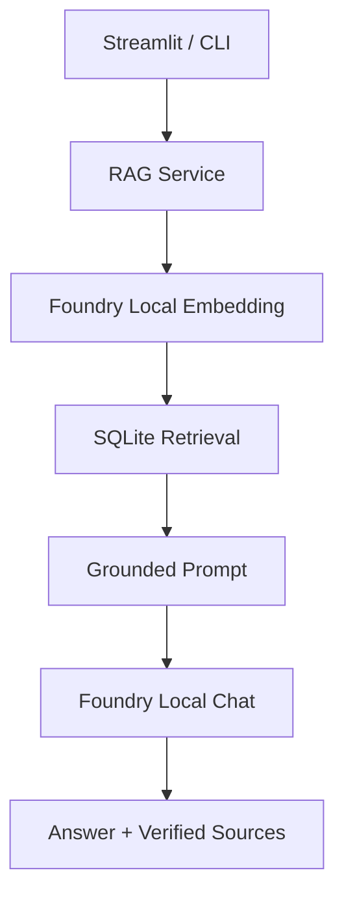

# Local RAG AI Assistant with Microsoft Foundry Local

Microsoft Foundry Local kullanan, belgeler üzerinde soru-cevap yapabilen tamamen yerel
bir RAG (Retrieval-Augmented Generation) uygulamasıdır. Dokümanlar, chunk'lar,
metadata ve embedding vektörleri SQLite içinde tutulur; semantic/hybrid retrieval
sonuçları grounded prompt ile yerel chat modeline verilir. CLI ve Streamlit arayüzü,
model cevabından bağımsız olarak uygulama tarafından doğrulanan kaynakları gösterir.

Python paketleri ve modeller ilk kez indirildikten sonra normal kullanımda cloud API,
Azure kaynağı veya API key gerekmez. Bununla birlikte tam ağ izolasyonu otomatik olarak
kanıtlanmamıştır; ağ adaptörü kapalı uçtan uca test manuel doğrulama adımıdır.

## İçindekiler

- [Proje Durumu](#proje-durumu)
- [Demo Özeti](#demo-özeti)
- [Neden Bu Proje?](#neden-bu-proje)
- [Sistem Mimarisi](#sistem-mimarisi)
- [Kullanılan Teknolojiler](#kullanılan-teknolojiler)
- [Başlangıçtaki Proje Durumu](#başlangıçtaki-proje-durumu)
- [Dört Haftalık Geliştirme Süreci](#dört-haftalık-geliştirme-süreci)
- [Önemli Sorunlar ve Çözümler](#önemli-sorunlar-ve-çözümler)
- [Test Gelişimi](#test-gelişimi)
- [Evaluation Sonuçları](#evaluation-sonuçları)
- [Benchmark Sonuçları](#benchmark-sonuçları)
- [Kurulum](#kurulum)
- [Model Hazırlığı](#model-hazırlığı)
- [Doküman İndeksleme](#doküman-indeksleme)
- [CLI Kullanımı](#cli-kullanımı)
- [Streamlit UI](#streamlit-ui)
- [Evaluation, Benchmark ve Offline Check](#evaluation-benchmark-ve-offline-check)
- [Testler](#testler)
- [Proje Yapısı](#proje-yapısı)
- [Git ve Geliştirme Geçmişi](#git-ve-geliştirme-geçmişi)
- [Gizlilik, Güvenlik ve Responsible AI](#gizlilik-güvenlik-ve-responsible-ai)
- [Bilinen Sınırlamalar](#bilinen-sınırlamalar)
- [Gelecek Geliştirmeler](#gelecek-geliştirmeler)
- [Kaynaklar](#kaynaklar)
- [Lisans](#lisans)

## Proje Durumu

| Alan | Durum |
| --- | --- |
| Dört haftalık geliştirme | Tamamlandı |
| Unit test | 187 passed |
| Local embedding | Doğrulandı |
| Local chat inference | Doğrulandı |
| Streamlit UI | Tamamlandı |
| Evaluation | Tamamlandı |
| Offline varsayılan | Etkin |
| Tam ağ izolasyonu | Manuel doğrulama gerekiyor |

`offline_check.py` sonucu `OVERALL=WARN` olarak doğrulandı. Cached modeller, runtime
DB ve cloud/API kaynak taraması başarılıdır; ancak bu kontroller fiziksel ağ
izolasyonunun kanıtı değildir.

## Demo Özeti

Kullanıcı uygulamada:

- UTF-8 `.txt` ve `.md` belgeleri yükleyebilir;
- belgeleri güvenli ve idempotent biçimde indeksleyebilir;
- terminalden veya Streamlit üzerinden soru sorabilir;
- cevapla birlikte doğrulanmış dosya/chunk kaynaklarını görebilir;
- debug modunda semantic ve combined skorları inceleyebilir;
- retrieval sonucu yoksa deterministik “Belgelerde bu bilgi bulunamadı.” davranışını
  görebilir;
- retrieval evaluation ve küçük performans benchmark'ını çalıştırabilir.

Repository'de doğrulanmış final UI ekran görüntüsü bulunmadığı için bu README'de
screenshot kullanılmamıştır. Ayrıntılı sunum akışı için [demo metnine](docs/demo-script.md)
bakın.

## Neden Bu Proje?

Genel amaçlı bir dil modeli, kullanıcının özel ders notlarını, şirket içi belgelerini
veya yerel dosyalarını kendiliğinden bilmez. RAG önce soruyla ilgili belge parçalarını
bulur, sonra bu parçaları modele bağlam olarak verir. Böylece cevap özel dokümanlara
dayandırılabilir.

Yerel yaklaşımın başlıca faydaları şunlardır:

- belgeler ve model inference işlemleri kullanıcının bilgisayarında kalır;
- normal kullanımda API çağrısı başına maliyet yoktur;
- model cache hazırlandıktan sonra internet olmadan çalışma hedeflenir;
- API key veya cloud credential yönetimi gerekmez;
- özel belge koleksiyonlarıyla çalışılabilir.

RAG hallucination riskini azaltır, tamamen ortadan kaldırmaz. Model doğru kaynaklar
getirilse bile ayrıntıları yanlış eşleyebilir. Bu nedenle uygulama model metnini
değiştirmek yerine retrieval metadata'sından doğrulanmış ayrı bir kaynak listesi sunar.

## Sistem Mimarisi



Ingestion akışı:

```text
.txt/.md → validation → chunking → local embedding → SQLite
```

Başlıca bileşenler:

- `app_ui.py`: Türkçe Streamlit arayüzü ve işlem düğmeleri.
- `ui_logic.py`: upload, ayar, soru ve sunum doğrulamaları.
- `main.py`: tek soru ve interaktif grounded RAG CLI.
- `rag_service.py`: Retrieve → Augment → Generate orchestration.
- `prompt_builder.py`: context bütçeli grounded prompt.
- `citations.py`: geçerli ve bilinmeyen inline citation ayrımı.
- `chat_utils.py`: streaming cevap toplama ve reasoning temizleme.
- `foundry_runtime.py`: SDK, model, client, unload ve cleanup yaşam döngüsü.
- `ingestion_service.py`, `chunking.py`, `storage.py`: idempotent ingestion ve
  normalize SQLite katmanı.
- `retriever.py`, `retrieval_utils.py`: semantic/hybrid full-scan retrieval.

Daha ayrıntılı diyagramlar için [mimari belgesine](docs/architecture.md) bakın.

## Kullanılan Teknolojiler

| Teknoloji | Doğrulanmış sürüm / rol |
| --- | --- |
| Python | 3.13.2 |
| Microsoft Foundry Local SDK WinML | 1.2.4 |
| NumPy | 2.5.2, cosine similarity ve vector işlemleri |
| Streamlit | 1.62.0, yerel kullanıcı arayüzü |
| SQLite | Python standart kütüphanesi, belge/chunk/embedding deposu |
| pytest | 8.4.2 |
| qwen3-embedding-0.6b | Yerel embedding modeli, 1024 dimension |
| qwen3-1.7b | Yerel chat modeli |

Hedef ortam Windows x64 ve Python 3.13'tür. Proje doğrudan `openai` import etmez;
`openai` paketi Foundry Local SDK'nın transitif bağımlılığıdır. WinML ortamında
`foundry-local-sdk-winml` kullanılır; standart `foundry-local-sdk` varyantını aynı
ortama ayrıca kurmayın.


## Dört Haftalık Geliştirme Süreci

### Hafta 1 — Güvenli Temel ve Foundry Local

`feat/week1-foundation` üzerinde önce test ve runtime güvenliği kuruldu:

- `pytest.ini` ile keşif yalnızca `tests/` diziniyle sınırlandı;
- model ve DB'den bağımsız `retrieval_utils.py` oluşturuldu;
- cosine similarity için boyut, boş vektör ve finite değer kontrolleri eklendi;
- import sırasında çalışan yan etkiler kaldırıldı;
- Python artifactleri, `.venv`, runtime ve recovery yolları `.gitignore` kapsamına alındı;
- izole `.venv`, sabit runtime/dev bağımlılıkları ve `requirements-lock.txt` hazırlandı;
- `foundry_runtime.py` ile lazy SDK initialization, offline-by-default davranışı,
  explicit `allow_download`, model ownership, cleanup ve unload retry uygulandı;
- shared model cache kullanıcı tarafından açıkça seçilen bir opt-in oldu.

Cached embedding smoke çalışmasında 5 embedding ve 1024 dimension doğrulandı. Cached
chat modeli de indirmesiz çalıştırıldı. Hafta sonunda test sayısı 81'e ulaştı.
Detaylar [Week 1 belgesindedir](docs/week-1.md).

Önemli bir mühendislik dersi test discovery sırasında yaşandı: eski `sqlite_test.py`
import sırasında tracked legacy DB'ye üç örnek kayıt ekledi. Sorun hash kontrolü,
kurtarma yedeği, Git HEAD ile byte düzeyi doğrulama, stat-cache invalidation ve
sınırlandırılmış pytest discovery ile güvenli biçimde çözüldü. Kişisel recovery yolu
ve kullanıcı verisi public dokümana taşınmadı.

### Hafta 2 — Ingestion, SQLite ve Retrieval

`week2` branch'inde legacy `documents.db` salt korunurken yeni çalışma veritabanı
`runtime_data/rag.db` olarak ayrıldı. Normalize şema dört parçadan oluşur:

- `schema_info`: şema sürümü;
- `documents`: source, content SHA-256, boyut ve indeks zamanı;
- `chunks`: document ilişkisi, sıra ve içerik;
- `embeddings`: model alias, dimension ve vektör.

Eklenen davranışlar:

- varsayılan 800 karakter chunk ve 100 karakter overlap;
- deterministik `.txt`/`.md` keşfi ve chunking;
- ham dosya byte'larının SHA-256 değeriyle idempotency;
- dosya başına transaction ve rollback;
- `added`, `updated`, `unchanged`, `missing` ve explicit `delete_missing` politikası;
- model alias/dimension tutarlılık kontrolü;
- `top_k`, `min_score` ve deterministik hybrid sıralama.

Vector search, anlaşılabilirlik için NumPy full scan kullanır ve küçük veri setine
yöneliktir. Gerçek smoke sonucunda 5 document, 5 chunk, 5 embedding ve 1024 dimension
doğrulandı; ikinci ingestion tüm belgeleri unchanged bıraktı ve Grand Slam sorgusunda
`grand_slam.txt` ilk sonuç oldu. Test sayısı 129'a yükseldi. Detaylar
[Week 2 belgesindedir](docs/week-2.md).

### Hafta 3 — Grounded RAG

`week3` branch'inde retrieval yerel chat modeliyle birleştirildi:

- `prompt_builder.py`: stabil `[K1]`, `[K2]` etiketleri ve 7000 karakter context bütçesi;
- `rag_service.py`: retrieval, prompt ve generation orchestration;
- `citations.py`: model citation doğrulaması;
- `chat_utils.py`: ortak streaming parser ve `<think>` temizliği;
- `main.py`: tek soru/interaktif CLI, kaynaklar ve debug skorları.

Prompt, belge içindeki talimatları veri olarak sınırlar; `/no_think` user mesajının
ilk satırında kullanılır. Retrieval sonucu yoksa chat modeli hiç çağrılmaz. Yaklaşık
8 GB RAM için embedding ve chat modelleri aynı anda tutulmak yerine ardışık lifecycle
aşamalarında çalıştırılır.

Kaynak listesi model cevabından değil prompta gerçekten giren retrieval metadata'sından
oluşturulur. Model inline citation üretmezse cevap değiştirilmez veya otomatik `[K1]`
eklenmez; CLI/UI açık bir uyarı gösterir. Test sayısı 165'e ulaştı.

Gerçek smoke'ta retrieval ve generation çalıştı, `grand_slam.txt` doğru kaynak oldu.
Ancak küçük chat modeli geçerli inline citation üretmedi ve doğru kaynak mevcutken bir
turnuva ayrıntısını yanlış eşledi. Bu sonuç gizlenmedi: verified source list, citation
durumu ve “model yanıtını kaynaklarla kontrol edin” notu Responsible AI davranışının
parçası oldu. Detaylar [Week 3 belgesindedir](docs/week-3.md).

### Hafta 4 — UI, Evaluation ve Finalizasyon

`week4` branch'inde proje son kullanıcı ve ölçüm araçlarıyla tamamlandı:

- `app_ui.py` ve `ui_logic.py` ile Streamlit UI;
- yalnızca `.txt`/`.md`, 5 MiB sınırı, UTF-8 kontrolü, path traversal engeli ve
  geçici dosya + `os.replace` ile atomik upload;
- cevap ve ingestion özetini koruyan Streamlit session state;
- UI açılışında model yüklemeyen, yalnızca butonla çalışan işlemler;
- `evaluate.py`, `benchmark.py`, `offline_check.py`;
- 11 vakalık `evaluation/evaluation_cases.json`;
- headless Streamlit health check ve final 187 unit test;
- mimari, evaluation, offline doğrulama, demo ve sunum belgeleri.

Final proje `0e7b5d4` commit'iyle tamamlandı ve `180a398` merge commit'iyle `main`
branch'ine alındı. Detaylar [Week 4 belgesindedir](docs/week-4.md).

## Önemli Sorunlar ve Çözümler

| Sorun | Kök neden | Çözüm |
| --- | --- | --- |
| Pytest gerçek DB'ye yazdı | Eski `*_test.py` scriptleri import sırasında çalışıyordu | `pytest.ini`, tests-only discovery, import-safe kod |
| Git DB değişikliğini göstermedi | Boyut/mtime stat-cache ile eşleşiyordu | Hash karşılaştırması, mtime refresh, HEAD restore |
| Disk alanı hızla azaldı | Docker, cacheler ve dinamik pagefile | Reboot, onaylı pip/npm cache temizliği, disk eşikleri |
| Modeller tekrar indirilecekti | App-name bazlı ayrı cacheler | Explicit shared `model_cache_dir` |
| Küçük model reasoning'e token harcadı | Qwen thinking template | `/no_think`, sade prompt, reasoning temizleme |
| Model inline citation üretmedi | Küçük model davranışı | Verified source list ve açık kullanıcı uyarısı |
| Unload retry mümkün değildi | Cleanup sahiplik kaydı erken temizleniyordu | Başarısız modeller için retry-safe lifecycle |

## Test Gelişimi

Başlangıçta otomatik test altyapısı yoktu. Dört hafta boyunca model, DB, ingestion,
retrieval, RAG, CLI, upload, Streamlit ve evaluation davranışları fake nesneler ve
geçici dosyalarla kapsandı.

| Aşama | Test |
| --- | ---: |
| İlk güvenli foundation | 31 |
| Foundry runtime | 64 |
| Week 1 tamamlandı | 81 |
| Week 2 | 129 |
| Week 3 | 165 |
| Final Week 4 | 187 |

## Evaluation Sonuçları

Gerçek retrieval evaluation `top_k=3` ve `min_score=0.2` ile çalıştırıldı:

| Metrik | Sonuç |
| --- | ---: |
| Vaka / answerable | 11 / 9 |
| Hit Rate@3 | 1.0000 |
| MRR | 0.8889 |
| Unanswerable no-result rate | 0.0000 |
| Source accuracy | 0.8182 |
| Ortalama latency | 874.77 ms |
| p50 | 843.32 ms |
| p95 | 1179.85 ms |

Bu metrikler retrieval kalitesini ölçer; generation doğruluğu değildir. İki
unanswerable soru da retrieval sonucu getirdi. Dataset sonucu iyileştirmek amacıyla
sonradan değiştirilmedi. Citation validity retrieval-only evaluation'da ölçülmedi ve
`null` raporlandı. Ayrıntılar [evaluation belgesindedir](docs/evaluation.md).

## Benchmark Sonuçları

Gerçek ölçümler:

| Aşama | Süre |
| --- | ---: |
| Runtime + embedding load | 10195.28 ms |
| Query embedding | 1078.01 / 957.46 / 805.52 ms |
| Retrieval, embedding hariç | 10.36 / 5.05 / 5.30 ms |
| Prompt building | 0.24 ms |
| Chat generation | 41800.98 ms |
| Chat runtime + generation | 49173.18 ms |

Ölçüm sırasında DB 5 document, 5 chunk ve 155648 byte idi. Donanım Intel Core
i5-12500H, 8 GB sınıfı RAM ve RTX 3050 Laptop GPU'dur. Yapılandırılmış embedding ve
chat modelleri generic CPU variant olarak çalıştırıldı; GPU adı sonuçların GPU
inference ile ölçüldüğü anlamına gelmez. Tek process ölçümü yapıldığı için cold/warm
iddiasında bulunulmadı. Generation çıktısı otomatik olarak doğru kabul edilmedi.

## Kurulum

### Windows x64 ve izole ortam

```powershell
git clone https://github.com/beyzatasgin/RAG.git
cd RAG

& "$env:LOCALAPPDATA\Programs\Python\Python313\python.exe" -m venv .venv
.\.venv\Scripts\Activate.ps1

python -m pip install -r requirements-lock.txt
```

PowerShell yalnızca mevcut process için activation script'ini engelliyorsa:

```powershell
Set-ExecutionPolicy -Scope Process -ExecutionPolicy Bypass
.\.venv\Scripts\Activate.ps1
```

Global execution policy değiştirilmez.

Runtime ve test bağımlılıklarını ayrı kurmak için:

```powershell
python -m pip install -r requirements.txt
python -m pip install -r requirements-dev.txt
```

`requirements-lock.txt`, doğrulanmış Windows x64 / Python 3.13 ortamının tam paket
setidir. Model dosyaları lock dosyasına dahil değildir.

## Model Hazırlığı

İlk model edinimi internet bağlantısı ve yeterli disk alanı gerektirir. Hedef alias'lar:

- `qwen3-embedding-0.6b`
- `qwen3-1.7b`

Normal CLI/UI örneklerinde `--allow-download` kullanılmaz. Shared cache açık opt-in'dir:

```powershell
$env:RAG_MODEL_CACHE_DIR="$env:USERPROFILE\.foundry_local_samples\cache\models"
$env:RAG_APP_DATA_DIR="$env:USERPROFILE\.local-rag-assistant"
$env:RAG_LOGS_DIR="$env:USERPROFILE\.local-rag-assistant\logs"
$env:RAG_DB_PATH="runtime_data\rag.db"
```

Cache yolu kaynak koda hard-code edilmez. SDK katalog metadata'sını güncelleyebilir;
metadata değişmemesi ağsızlık kanıtı değildir. Aynı shared cache'i farklı SDK
sürümleriyle veya eşzamanlı uygulamalarla kullanmak risklidir.

## Doküman İndeksleme

`ingest.py --help` ile uyumlu offline-varsayılan örnek:

```powershell
python ingest.py `
  --data-dir data `
  --db-path $env:RAG_DB_PATH `
  --chunk-size 800 `
  --chunk-overlap 100 `
  --model-cache-dir $env:RAG_MODEL_CACHE_DIR `
  --app-data-dir $env:RAG_APP_DATA_DIR `
  --logs-dir $env:RAG_LOGS_DIR
```

İlk başarılı ingestion yeni/changed belgeleri chunk'layıp embed eder. Aynı dosyalarla
ikinci çalıştırma content SHA-256 eşleştiği için belgeleri `unchanged` bırakır ve
yeniden embedding üretmez. Eksik dosyalar normalde korunur; silme yalnızca bilinçli
`--delete-missing` seçimiyle yapılır.

## CLI Kullanımı

### Tek soru

```powershell
python main.py `
  --db-path $env:RAG_DB_PATH `
  --question "Grand Slam turnuvaları hangileridir?" `
  --top-k 3 `
  --min-score 0.2 `
  --context-budget 7000 `
  --max-output-tokens 192 `
  --model-cache-dir $env:RAG_MODEL_CACHE_DIR `
  --app-data-dir $env:RAG_APP_DATA_DIR `
  --logs-dir $env:RAG_LOGS_DIR `
  --debug
```

### İnteraktif mod

```powershell
python main.py `
  --db-path $env:RAG_DB_PATH `
  --model-cache-dir $env:RAG_MODEL_CACHE_DIR `
  --app-data-dir $env:RAG_APP_DATA_DIR `
  --logs-dir $env:RAG_LOGS_DIR
```

`çık`, `exit`, `quit`, Ctrl+C veya EOF ile kapanır. Küçük model cevapları doğruluk
garantisi taşımaz; “Kullanılan kaynaklar” bölümündeki dosyalarla kontrol edilmelidir.

## Streamlit UI

Önce [Model Hazırlığı](#model-hazırlığı) bölümündeki environment değişkenlerini
tanımlayın, ardından:

```powershell
python -m streamlit run app_ui.py
```

UI şu özellikleri sunar:

- DB belge/chunk/embedding durumu;
- soru-cevap, verified sources ve debug skorları;
- `.txt`/`.md` upload, 5 MiB ve UTF-8 kontrolü;
- atomik overwrite ve manuel “Belgeleri indeksle” işlemi;
- session state içinde son cevap ve ingestion özeti.

UI açılışında model yüklenmez. Model işlemi yalnızca butona basıldığında başlar ve
her işlem sonunda runtime cleanup yapılır. UI'da download butonu yoktur ve
`allow_download=False` kullanılır.

## Evaluation, Benchmark ve Offline Check

### Retrieval evaluation

```powershell
python evaluate.py `
  --dataset evaluation/evaluation_cases.json `
  --db-path $env:RAG_DB_PATH `
  --top-k 3 `
  --min-score 0.2 `
  --model-cache-dir $env:RAG_MODEL_CACHE_DIR `
  --app-data-dir $env:RAG_APP_DATA_DIR `
  --logs-dir $env:RAG_LOGS_DIR `
  --output runtime_data/evaluation-results.json
```

### Küçük benchmark

```powershell
python benchmark.py `
  --db-path $env:RAG_DB_PATH `
  --model-cache-dir $env:RAG_MODEL_CACHE_DIR `
  --app-data-dir $env:RAG_APP_DATA_DIR `
  --logs-dir $env:RAG_LOGS_DIR `
  --top-k 3 `
  --min-score 0.2 `
  --include-generation `
  --output runtime_data/benchmark-results.json
```

`--include-generation` en fazla bir gerçek chat generation çalıştırır. Üretilen cevabı
kalite açısından otomatik puanlamaz.

### Offline readiness

```powershell
python offline_check.py `
  --db-path $env:RAG_DB_PATH `
  --model-cache-dir $env:RAG_MODEL_CACHE_DIR
```

Bu araç cache, DB integrity, embedding metadata ve kaynak kodda bilinen cloud endpoint
kalıplarını kontrol eder. Tam ağ izolasyonunu kanıtlamadığı için `OVERALL=WARN` kabul
edilir. Manuel adımlar [offline doğrulama belgesindedir](docs/offline-verification.md).

## Testler

```powershell
$env:PYTHONDONTWRITEBYTECODE="1"
python -m pytest tests -p no:cacheprovider -q
```

Son doğrulanmış sonuç:

```text
187 passed
```

Unit suite gerçek Foundry modelini, evaluation veya benchmark'ı çalıştırmaz. Fake
client/manager, geçici DB ve Streamlit testing API kullanır.

## Proje Yapısı

```text
RAG/
├── app_ui.py, ui_logic.py              # Streamlit UI ve güvenli upload
├── main.py, rag_service.py              # Grounded RAG CLI/orchestration
├── prompt_builder.py, citations.py      # Prompt ve citation doğrulama
├── foundry_runtime.py, chat_utils.py    # Yerel model yaşam döngüsü
├── ingest.py, ingestion_service.py      # İdempotent ingestion
├── chunking.py, storage.py              # Chunking ve normalize SQLite
├── retriever.py, retrieval_utils.py     # Semantic/hybrid retrieval
├── evaluate.py, benchmark.py            # Ölçüm araçları
├── offline_check.py                     # Muhafazakâr offline readiness
├── evaluation/                          # Sabit evaluation vakaları
├── data/                                # Beş örnek tenis dokümanı
├── tests/                               # 187 yan etkisiz unit test
├── docs/                                # Week 1–4 ve final belgeleri
├── runtime_data/                        # Ignore edilen DB/upload/result/log alanı
└── documents.db                         # Korunan legacy veritabanı
```

## Git ve Geliştirme Geçmişi

| Commit | Açıklama |
| --- | --- |
| `68b1857` | Safe retrieval test foundation |
| `e399467` | Verified Windows dependency pins |
| `71f4583` | Foundry runtime lifecycle |
| `f9320bc` | Week 1 completion |
| `9dc4950` | Week 2 ingestion/retrieval |
| `0a9418b` | Week 3 grounded RAG |
| `0e7b5d4` | Week 4/final project |
| `180a398` | Merge to `main` |

Bu commitlerin tamamı repository Git geçmişinde doğrulanmıştır.

## Gizlilik, Güvenlik ve Responsible AI

- Belgeler, embeddings ve model inference yerel makinede işlenir.
- Uygulama API key veya cloud credential okumaz.
- `runtime_data/`, uploadlar, ölçüm sonuçları, `.venv` ve recovery artifactleri
  Git tarafından ignore edilir.
- Upload adında traversal, absolute path, drive path, klasör bileşeni, geçersiz UTF-8
  ve 5 MiB üzeri içerik reddedilir.
- Belgelerdeki talimatlar prompt içinde veri olarak sınırlandırılır; bu prompt injection
  riskini azaltır fakat mutlak güvenlik sağlamaz.
- Kaynak listesi model metninden değil retrieval metadata'sından oluşturulur.
- Model inline citation üretmezse cevap değiştirilmez; kullanıcı açıkça uyarılır.
- Kullanıcı model cevabını kaynak belgelerle kontrol etmelidir.
- Shared cache metadata'sı SDK tarafından yazılabilir.
- Uygulama tek kullanıcılı/local eğitim projesidir; production veya multi-user servis
  güvenlik modeli sunmaz.

## Bilinen Sınırlamalar

- 8 GB RAM sınıfında chat generation yavaştır.
- Doğrulanan model variantları generic CPU'dur; mevcut GPU kullanılmayabilir.
- NumPy full scan küçük dataset içindir ve büyük koleksiyonlara ölçeklenmez.
- Upload yalnızca UTF-8 `.txt` ve `.md` destekler.
- Küçük chat modeli hallucination yapabilir veya ayrıntıları yanlış eşleyebilir.
- Inline citation üretimi garanti değildir.
- Evaluation'da unanswerable threshold zayıf kalmış, iki cevapsız vaka sonuç getirmiştir.
- Ağ adaptörü kapalı tam offline uçtan uca test manueldir.
- Shared cache farklı SDK sürümleri/eşzamanlı uygulamalarla güvenli kabul edilmez.
- Production ve çok kullanıcılı deployment hedeflenmemiştir.


## Kaynaklar

Aşağıdaki bağlantılar erişilebilirlik açısından doğrulanmıştır:

- [Microsoft Tech Community — Building Your First Local RAG Application with Foundry Local](https://techcommunity.microsoft.com/blog/azuredevcommunityblog/building-your-first-local-rag-applicationwith-foundry-local/4501968)
- [Microsoft Foundry Local resmî dokümantasyonu](https://learn.microsoft.com/azure/ai-foundry/foundry-local/)
- [Microsoft Foundry Local başlangıç rehberi](https://learn.microsoft.com/azure/ai-foundry/foundry-local/get-started)
- [SQLite resmî sitesi](https://www.sqlite.org/index.html)

Tech Community bağlantısı bu projenin ilham aldığı Microsoft Foundry Local RAG
tutorial'ıdır. README bağlantıları çalışma zamanında çağrılmaz.

