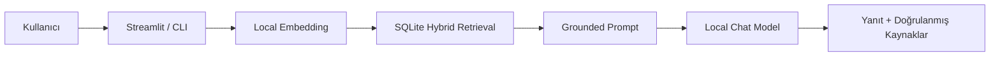

# Local RAG AI Assistant with Microsoft Foundry Local

Microsoft Foundry Local ile tamamen yerel çalışan, teknik destek belgeleri üzerinde
soru-cevap yapabilen bir RAG (Retrieval-Augmented Generation) uygulamasıdır.

Uygulama; belgeleri parçalara ayırır, yerel embedding üretir, ilgili içerikleri
SQLite üzerinden bulur ve grounded prompt ile yerel chat modelinden yanıt üretir.
CLI ve Streamlit arayüzü, model yanıtından bağımsız olarak doğrulanmış kaynakları
dosya ve chunk düzeyinde gösterir.


## Özellikler

- Microsoft Foundry Local ile yerel embedding ve chat inference
- `.txt` ve `.md` belgeleri için güvenli, idempotent indeksleme
- Semantic ve keyword skorlarını birleştiren hybrid retrieval
- Kaynaklarla sınırlandırılmış grounded yanıt üretimi
- Model metninden bağımsız doğrulanmış kaynak listesi
- SQLite üzerinde belge, chunk ve embedding saklama
- Tek soru ve interaktif CLI kullanımı
- Streamlit tabanlı Türkçe kullanıcı arayüzü
- UTF-8, dosya boyutu ve güvenli dosya adı kontrolleri
- Retrieval evaluation, benchmark ve offline-readiness araçları
- Model cache hazırlandıktan sonra offline-varsayılan çalışma

## Güncel Durum

| Alan | Durum |
| --- | --- |
| Yazılım destek belgesi | 8 |
| İndekslenen chunk | 60 |
| Embedding | 60 |
| Embedding modeli | `qwen3-embedding-0.6b` |
| Chat modeli | `qwen3-1.7b` |
| Embedding boyutu | 1024 |
| Unit test | 189 passed |
| Evaluation dataset | 22 vaka: 16 answerable, 6 unanswerable |
| DB integrity | `ok` |
| Offline varsayılan | Etkin |

Güncel belge koleksiyonu Python ortamları, pip, Git/GitHub, SQLite, RAG,
proje sorun giderme ve Microsoft Foundry Local kullanımını kapsar.

## Sistem Mimarisi


```mermaid
flowchart LR
    USER["Kullanıcı"] --> UI["Streamlit / CLI"]
    UI --> EMB["Local Embedding"]
    EMB --> DB["SQLite Hybrid Retrieval"]
    DB --> PROMPT["Grounded Prompt"]
    PROMPT --> LLM["Local Chat Model"]
    LLM --> ANSWER["Yanıt + Doğrulanmış Kaynaklar"]
```

İndeksleme akışı:

```text
.txt/.md → validation → chunking → local embedding → SQLite
```

Soru-cevap akışı:

```text
question → embedding → hybrid retrieval → grounded prompt → local generation
```

## Kullanılan Teknolojiler

| Teknoloji | Rol |
| --- | --- |
| Python 3.13 | Uygulama ve araçlar |
| Microsoft Foundry Local SDK WinML | Yerel model yaşam döngüsü |
| NumPy | Cosine similarity ve vektör işlemleri |
| SQLite | Belge, chunk ve embedding deposu |
| Streamlit | Yerel kullanıcı arayüzü |
| pytest | Otomatik testler |

Hedef ortam Windows x64 ve Python 3.13'tür. Proje doğrudan bir cloud API veya
API key kullanmaz.

## Kurulum

Repository'yi klonlayın:

```powershell
git clone https://github.com/beyzatasgin/RAG.git
cd RAG
```

Python 3.13 ile sanal ortam oluşturun ve etkinleştirin:

```powershell
& "$env:LOCALAPPDATA\Programs\Python\Python313\python.exe" -m venv .venv
Set-ExecutionPolicy -Scope Process -ExecutionPolicy RemoteSigned
.\.venv\Scripts\Activate.ps1
```

Bağımlılıkları kurun:

```powershell
python -m pip install -r requirements-lock.txt
```

Runtime ve geliştirme bağımlılıklarını ayrı kurmak isterseniz:

```powershell
python -m pip install -r requirements.txt
python -m pip install -r requirements-dev.txt
```

## Model Cache Ayarları

İlk model edinimi internet bağlantısı ve yeterli disk alanı gerektirir. Modeller
cache'e alındıktan sonra normal uygulama akışında otomatik indirme kapalıdır.

PowerShell oturumunda gerekli yolları tanımlayın:

```powershell
$env:RAG_MODEL_CACHE_DIR="$env:USERPROFILE\.foundry_local_samples\cache\models"
$env:RAG_APP_DATA_DIR="$env:USERPROFILE\.local-rag-assistant"
$env:RAG_LOGS_DIR="$env:USERPROFILE\.local-rag-assistant\logs"
$env:RAG_DB_PATH="runtime_data\rag.db"
```

Bu değişkenler yeni bir PowerShell terminalinde otomatik olarak korunmaz. Uygulamayı
başlatmadan önce aynı terminal oturumunda yeniden tanımlanmalıdır.

## Belgeleri İndeksleme

`data/` klasöründeki belgeleri indeksleyin:

```powershell
python ingest.py `
  --data-dir data `
  --db-path $env:RAG_DB_PATH `
  --chunk-size 800 `
  --chunk-overlap 100 `
  --model-cache-dir $env:RAG_MODEL_CACHE_DIR `
  --app-data-dir $env:RAG_APP_DATA_DIR `
  --logs-dir $env:RAG_LOGS_DIR
```

İndeksleme content SHA-256 değerini kullanır. Değişmeyen belgeler yeniden embed
edilmez ve `unchanged` olarak raporlanır.

Artık `data/` klasöründe bulunmayan eski belgelerin DB kayıtlarını kaldırmak için
bilinçli olarak `--delete-missing` seçeneği kullanılabilir:

```powershell
python ingest.py `
  --data-dir data `
  --db-path $env:RAG_DB_PATH `
  --model-cache-dir $env:RAG_MODEL_CACHE_DIR `
  --app-data-dir $env:RAG_APP_DATA_DIR `
  --logs-dir $env:RAG_LOGS_DIR `
  --delete-missing
```

## Streamlit Arayüzü

Ayarların tanımlandığı aynı terminalde çalıştırın:

```powershell
python -m streamlit run app_ui.py
```

Örnek soru:

```text
Python projesi için sanal ortam nasıl oluşturulur ve PowerShell'de nasıl etkinleştirilir?
```

Arayüz; belge, chunk ve embedding sayılarını, DB bütünlüğünü, yanıtı ve kullanılan
kaynakları gösterir. Model geçerli inline citation üretmezse yanıt değiştirilmez;
uygulama retrieval metadata'sından doğruladığı kaynakları ayrıca sunar.

## CLI Kullanımı

Tek soru:

```powershell
python main.py `
  --db-path $env:RAG_DB_PATH `
  --question "Windows PowerShell'de proje için sanal ortam nasıl oluşturulur?" `
  --top-k 3 `
  --min-score 0.2 `
  --context-budget 7000 `
  --max-output-tokens 192 `
  --model-cache-dir $env:RAG_MODEL_CACHE_DIR `
  --app-data-dir $env:RAG_APP_DATA_DIR `
  --logs-dir $env:RAG_LOGS_DIR `
  --debug
```

İnteraktif mod:

```powershell
python main.py `
  --db-path $env:RAG_DB_PATH `
  --model-cache-dir $env:RAG_MODEL_CACHE_DIR `
  --app-data-dir $env:RAG_APP_DATA_DIR `
  --logs-dir $env:RAG_LOGS_DIR
```

`çık`, `exit`, `quit`, Ctrl+C veya EOF ile kapanır.

## Testler

```powershell
$env:PYTHONDONTWRITEBYTECODE="1"
python -m pytest tests -p no:cacheprovider -q
```

Son doğrulanmış sonuç:

```text
189 passed
```

Unit testler gerçek model inference veya gerçek evaluation çalıştırmaz; fake
client/manager, geçici veritabanları ve Streamlit testing API kullanır.

## Evaluation ve Benchmark

Güncel dataset, yazılım destek alanında 22 vaka içerir: 16 answerable ve
6 unanswerable. Yeni koleksiyon için gerçek evaluation ve benchmark sonuçları
henüz yeniden ölçülmediğinden önceki ölçümler güncel sonuç olarak sunulmaz.

Retrieval evaluation:

```powershell
python evaluate.py `
  --dataset evaluation/evaluation_cases.json `
  --db-path $env:RAG_DB_PATH `
  --top-k 3 `
  --min-score 0.2 `
  --model-cache-dir $env:RAG_MODEL_CACHE_DIR `
  --app-data-dir $env:RAG_APP_DATA_DIR `
  --logs-dir $env:RAG_LOGS_DIR `
  --output runtime_data/evaluation-results.json
```

Küçük benchmark:

```powershell
python benchmark.py `
  --db-path $env:RAG_DB_PATH `
  --model-cache-dir $env:RAG_MODEL_CACHE_DIR `
  --app-data-dir $env:RAG_APP_DATA_DIR `
  --logs-dir $env:RAG_LOGS_DIR `
  --top-k 3 `
  --min-score 0.2 `
  --include-generation `
  --output runtime_data/benchmark-results.json
```

Bu araçlar retrieval başarısını ve süreleri ölçer; generation çıktısını otomatik
olarak doğru kabul etmez.

## Offline Readiness

```powershell
python offline_check.py `
  --db-path $env:RAG_DB_PATH `
  --model-cache-dir $env:RAG_MODEL_CACHE_DIR
```

Bu kontrol cache, DB integrity, embedding metadata ve bilinen cloud endpoint
kalıplarını inceler. `allow_download=False` ve başarılı readiness kontrolü,
ağ adaptörü kapalı uçtan uca testin yerine geçmez.

## Proje Yapısı

```text
RAG/
├── app_ui.py, ui_logic.py              # Streamlit UI ve güvenli upload
├── main.py, rag_service.py              # Grounded RAG orchestration
├── prompt_builder.py, citations.py      # Prompt ve citation doğrulama
├── foundry_runtime.py, chat_utils.py    # Yerel model yaşam döngüsü
├── ingest.py, ingestion_service.py      # İdempotent ingestion
├── chunking.py, storage.py              # Chunking ve SQLite
├── retriever.py, retrieval_utils.py     # Semantic/hybrid retrieval
├── evaluate.py, benchmark.py            # Ölçüm araçları
├── offline_check.py                     # Offline-readiness kontrolü
├── data/                                # 8 yazılım destek belgesi
├── evaluation/                          # 22 evaluation vakası
├── tests/                               # 189 unit test
├── docs/                                # Ayrıntılı teknik belgeler
└── runtime_data/                        # Git tarafından ignore edilen çalışma verisi
```

## Gizlilik, Güvenlik ve Sınırlamalar

- Belgeler, embeddings ve model inference yerel makinede işlenir.
- Uygulama API key veya cloud credential okumaz.
- Runtime DB, uploadlar, loglar, ölçüm sonuçları ve `.venv` Git'e eklenmez.
- Upload işlemi dosya türü, boyut, UTF-8 ve güvenli dosya adı kontrolleri uygular.
- Belge içindeki talimatlar veri olarak sınırlandırılır; bu yaklaşım prompt injection
  riskini azaltır ancak tamamen ortadan kaldırmaz.
- Küçük chat modeli hallucination yapabilir veya geçerli inline citation üretmeyebilir.
- Kullanıcı model yanıtını gösterilen kaynaklarla kontrol etmelidir.
- NumPy full scan küçük belge koleksiyonlarına yöneliktir.
- Tam ağ izolasyonu manuel olarak doğrulanmalıdır.
- Uygulama tek kullanıcılı yerel eğitim projesidir; production servisi değildir.

## Dokümantasyon

- [Mimari](docs/architecture.md)
- [Evaluation yaklaşımı](docs/evaluation.md)
- [Offline doğrulama](docs/offline-verification.md)
- [Demo akışı](docs/demo-script.md)
- [Week 1](docs/week-1.md)
- [Week 2](docs/week-2.md)
- [Week 3](docs/week-3.md)
- [Week 4](docs/week-4.md)

## Kaynaklar

- [Microsoft Tech Community — Building Your First Local RAG Application with Foundry Local](https://techcommunity.microsoft.com/blog/azuredevcommunityblog/building-your-first-local-rag-applicationwith-foundry-local/4501968)
- [Microsoft Foundry Local resmî dokümantasyonu](https://learn.microsoft.com/azure/ai-foundry/foundry-local/)
- [Microsoft Foundry Local başlangıç rehberi](https://learn.microsoft.com/azure/ai-foundry/foundry-local/get-started)
- [SQLite resmî sitesi](https://www.sqlite.org/index.html)

## Not

Model dosyalarının hazırlanması internet gerektirir. Cache hazırlandıktan sonraki
normal embedding ve chat inference akışı çevrimdışı çalışacak şekilde tasarlanmıştır.
Bu ifade, ağ adaptörü kapalı uçtan uca test yapılmadan mutlak ağ izolasyonu iddiası
olarak değerlendirilmemelidir.
