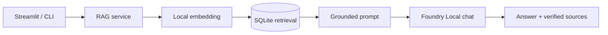
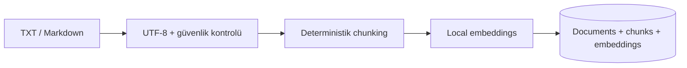

# Mimari

`foundry_runtime.py` SDK/model/client yaşam döngüsünü merkezileştirir. Retrieval
metadata'sı model cevabından bağımsızdır. `rag_service.py` prompta gerçekten alınan
chunk'ları `[K1]` etiketleriyle eşler. SQLite çözümü küçük eğitim veri seti için
anlaşılır full-scan vector search kullanır.

Embedding ve chat modelleri düşük bellekli bilgisayarda ardışık aşamalarda yüklenir.
Bu daha düşük tepe bellek karşılığında ek model yükleme süresi getirebilir.
